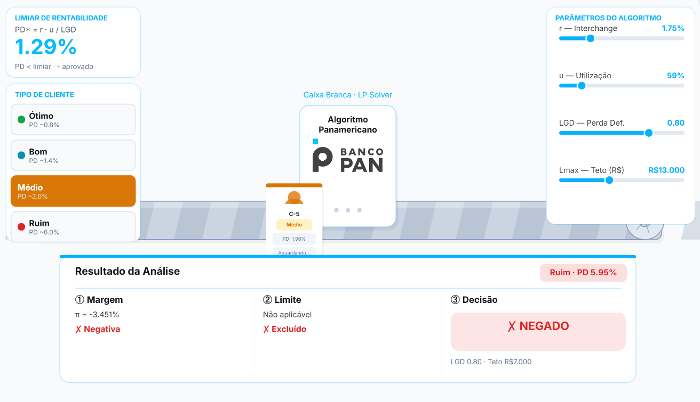
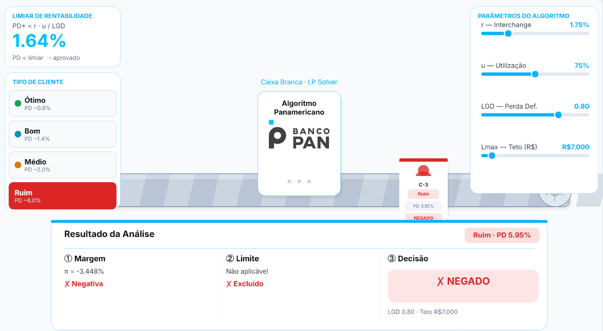

# Esteira de Crédito: Algoritmo Panamericano
### Microinterface Interativa · p5.js · Atividade Ponderada UXM06-2

<p align="center">
  
  &nbsp;&nbsp;
  
</p>

---

## 1. Introdução à proposta

A microinterface proposta é uma **animação demonstrativa do processamento**, especificamente uma esteira de crédito interativa que simula, em tempo real, como o algoritmo avalia cada cliente e toma sua decisão de limite.

Essa proposta contribui diretamente para o entendimento do modelo de crédito ao transformar conceitos matemáticos abstratos (como PD, LGD e margem de rentabilidade) em elementos visuais tangíveis e interativos. 

Ao permitir que a nossa persona Joana Amorim, analista de Política de Crédito, manipule os parâmetros e observe os efeitos instantaneamente na esteira, a interface torna o processo decisório transparente e acessível para públicos não técnicos, como a equipe de política de crédito. A abordagem se alinha com a proposta da entrega ao utilizar a biblioteca p5.js para construir uma microinterface funcional que comunica, de forma clara e envolvente, a lógica por trás da aprovação ou negação de crédito.

Além de cada perfil poder ser simulado na esteira para a joana ter um entendimento melhor sobre como cada perfi é interpretado pelo algoritmo, e possuindo maior explicabilidade.

### Uso do p5.js no código

O `sketch.js` explora vários recursos do p5.js de forma integrada:

- **Loop de animação (`draw`)**: toda a cena é redesenhada a 60 fps. O estado de cada cliente (`approach → processing → exit`) é atualizado frame a frame, criando fluxo contínuo sem bibliotecas externas de animação.
- **Geometria e formas**: a esteira é construída com `rect`, `beginShape/endShape` (listras diagonais paralelas em movimento) e `arc` (rolamentos e logo do Banco Pan). A "Caixa Branca" usa `rect` com raio de borda e camadas de `fill` com transparência para o efeito de glow pulsante.
- **Push/Pop e transformações**: cada avatar de cliente é desenhado dentro de `push/pop` com `translate` e `scale` (easing cúbico na aparição), isolando transformações sem afetar o restante da cena.
- **Interação com mouse**: sliders customizados detectam hover (`mouseMoved`), clique (`mousePressed`) e arrasto (`mouseDragged`) manualmente, sem elementos HTML, mantendo tudo dentro do canvas.
- **Tipografia e alinhamento**: `textAlign`, `textSize` e `textStyle` são usados para renderizar labels, valores e badges diretamente no canvas com precisão de pixel.

## 2. Rascunhos iniciais

### Esboço no papel

A ideia inicial surgiu com o intuito de criar uma animação simples que mostrasse como um cliente é interpretado pelo algoritmo. O cliente entra com seus dados em uma ponta e, da outra, sai com o crédito definido. Um hover de informação foi pensado para exibir a explicabilidade com o repertório matemático do modelo (PD, π, LGD).

A metáfora da **esteira de produção industrial** foi escolhida porque remete ao processamento em lote, real no contexto bancário — e torna o fluxo direcional (entrada → processamento → saída) imediatamente legível para um usuário não ténico, que se alinham com nossa persona do time de politica de credito.

Os elementos pensados desde o início:
- Esteira animada com listras diagonais em movimento
- Caixa central representando o algoritmo ("caixa branca")
- Avatares de clientes com cores por perfil de risco
- Painel lateral de parâmetros


### Refinamento no Figma


O Figma foi utilizado para definir a **hierarquia visual** e entender melhor a disposição dos elementos antes de codificar. As decisões tomadas nessa etapa:


### Adaptações durante o desenvolvimento

Durante a implementação em p5.js, algumas ideias foram simplificadas ou adaptadas:
- O hover de explicabilidade individual foi substituído pelo **badge de resultado global** (mais legível em animação contínua)
- O logo do Banco Pan foi construído vetorialmente dentro do p5.js (sem imagens externas), usando formas geométricas simples

---

## 3. Registro do resultado obtido

### O que foi entregue

A microinterface final é um arquivo `index.html` + `sketch.js` que roda diretamente no navegador, sem dependências além da biblioteca p5.js (carregada via CDN).

#### Funcionalidades implementadas

- **Esteira animada** com listras diagonais em movimento contínuo e rolamentos nas extremidades
- **Clientes gerados automaticamente** em 4 perfis de risco (Ótimo, Bom, Médio, Ruim), cada um com PD e capacidade aleatórios dentro da faixa do perfil
- **Caixa Branca central** com indicação visual de processamento e logo oficial do Banco Pan importado como imagem
- **4 sliders interativos** para ajuste em tempo real dos parâmetros `r`, `u`, `LGD` e `Lmax`, onde cada alteração recalcula imediatamente o limiar PD* e a decisão de todos os clientes futuros
- **Limiar de rentabilidade animado** com valor em destaque e cor pulsante
- **Micro-animações** de fade-in e scale-up nos avatares de clientes

#### Adequação ao Design System do Banco Pan

A interface foi atualizada para seguir as diretrizes visuais do [Design System do Banco Pan](https://designsystem.bancopan.com.br/). As principais adequações realizadas foram:

- **Paleta de cores**: o azul primário da interface utiliza o tom `#07B2FD`, cor institucional do Banco Pan, aplicado nos acentos dos painéis, sliders, barras de progresso e indicadores de destaque
- **Logo oficial**: a representação vetorial do logo foi substituída pela imagem oficial `logobancopan.png`, garantindo fidelidade à identidade visual da marca
- **Tipografia**: a fonte Inter foi mantida por sua proximidade com as fontes do sistema de design, preservando legibilidade e hierarquia visual
- **Tons neutros**: os tons de fundo e texto seguem a escala de cinzas do design system (`#0D1317`, `#333942`), criando contraste adequado e leitura confortável
- **Bordas e espaçamentos**: os cards e painéis utilizam bordas com opacidade sutil no azul Pan, cantos arredondados consistentes e espaçamento generoso entre elementos


#### Capturas do resultado

> *A interface roda em `index.html`, basta servir localmente para visualizar a animação completa.*

```
Arquivos entregues:
├── Assets/
│   ├── logobancopan.png
│   ├── clienteMedio.png
│   ├── clienteRuim.png
│   ├── FigmaSketch.png
│   └── paperSketch.jpg
├── index.html   → estrutura e estilos da página
├── sketch.js    → lógica p5.js da microinterface
└── readme.md    → esta documentação
```

---

## 4. Como rodar o projeto

O projeto é composto por arquivos estáticos (HTML + JS) e precisa ser servido por um servidor local para que o carregamento de imagens funcione corretamente. Abaixo estão as opções disponíveis:

### Opção 1: Python (recomendado)

Abra o terminal na pasta raiz do projeto e execute:

```bash
python -m http.server 8080
```

Em seguida, acesse no navegador: [http://localhost:8080](http://localhost:8080)

### Opção 2: Live Server (VS Code)

1. Instale a extensão **Live Server** no VS Code
2. Clique com o botão direito no arquivo `index.html`
3. Selecione **"Open with Live Server"**

### Opção 3: Node.js

```bash
npx serve .
```

> **Importante**: não abra o arquivo `index.html` diretamente pelo navegador (duplo clique), pois o carregamento da logo e de outros assets pode falhar por restrições de CORS em arquivos locais.