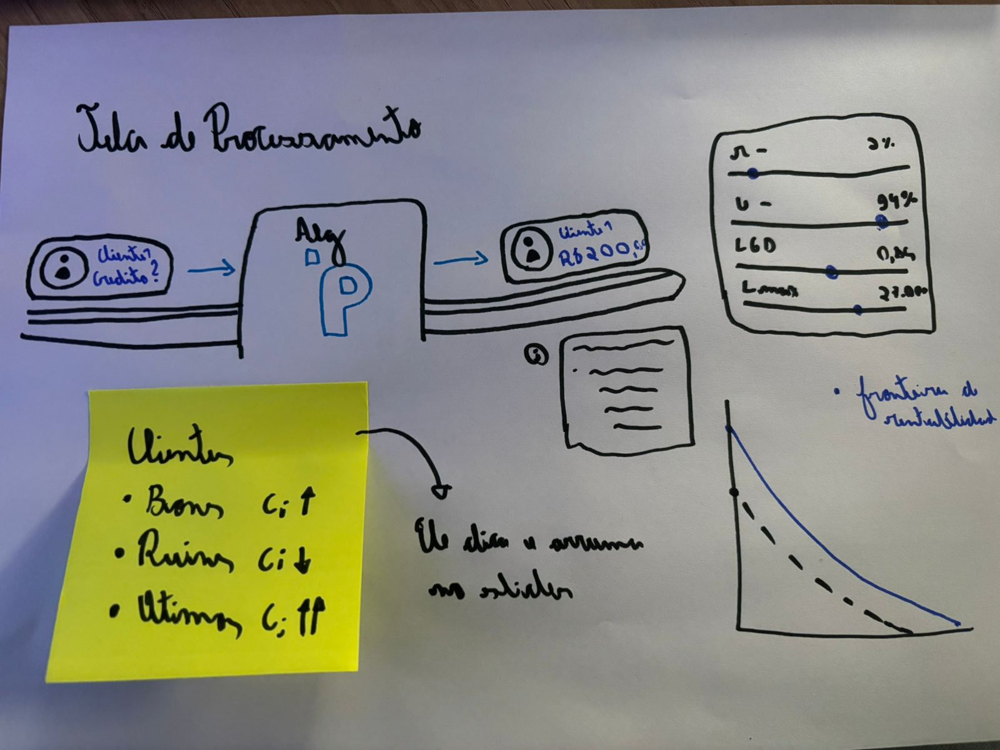
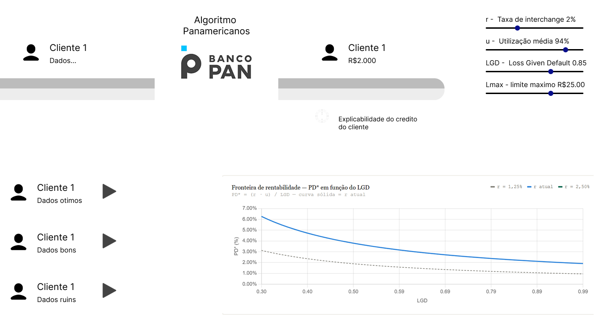

# Esteira de Crédito — Algoritmo Panamericano
### Microinterface Interativa · p5.js · Atividade Ponderada UXM06-2

---

## 1. Introdução à proposta

O projeto do módulo desenvolve um **algoritmo de concessão de crédito para o Banco Pan**, baseado em Programação Linear (LP) que determina, de forma otimizada, o limite de crédito a ser concedido a cada cliente a partir de variáveis financeiras e de risco.

A microinterface proposta é uma **animação demonstrativa do processamento** — especificamente, uma esteira de crédito interativa que simula, em tempo real, como o algoritmo avalia cada cliente e toma sua decisão de limite.

### O que a interface comunica

A animação coloca o usuário na perspectiva do algoritmo: clientes chegam anonimamente pela esteira (sem crédito), são absorvidos pela **"Caixa Branca"**  e saem pela outra ponta com um limite definido ou com a solicitação negada.

Durante o processamento, o usuário pode **ajustar os 4 parâmetros centrais do modelo** via sliders interativos:

| Parâmetro | Significado |
|---|---|
| `r` — Interchange | Taxa de receita por transação do cartão |
| `u` — Utilização | Fração esperada do limite que o cliente usa |
| `LGD` — Perda em caso de default | Percentual perdido quando o cliente não paga |
| `Lmax` — Teto (R$) | Limite máximo concedível pelo banco |

O **limiar de rentabilidade PD\*** — calculado como `PD* = r·u / LGD` — é exibido em tempo real no painel superior esquerdo. Todo cliente com probabilidade de default (`PD`) abaixo desse limiar é lucrativo para o banco e tem crédito aprovado; acima, é negado.

### Por que essa escolha

Dentre as opções do enunciado, esta proposta combina:
- **animação demonstrativa do processamento** (a esteira em movimento);
- **painel de controle e ajustes do algoritmo** (os sliders com feedback ao vivo);
- **visualização interativa dos resultados** (badge de resultado com perfil, PD e lucro π).

Isso torna o algoritmo — que é matematicamente denso — tangível e compreensível para qualquer usuário, sem exigir conhecimento prévio de LP.

---

## 2. Rascunhos iniciais

### Esboço no papel

A ideia inicial surgiu com o intuito de criar uma animação simples que mostrasse como um cliente é interpretado pelo algoritmo. O cliente entra com seus dados em uma ponta e, da outra, sai com o crédito definido. Um hover de informação foi pensado para exibir a explicabilidade com o repertório matemático do modelo (PD, π, LGD).

A metáfora da **esteira de produção industrial** foi escolhida porque remete ao processamento em lote — real no contexto bancário — e torna o fluxo direcional (entrada → processamento → saída) imediatamente legível.

Os elementos pensados desde o início:
- Esteira animada com listras diagonais em movimento
- Caixa central representando o algoritmo ("caixa branca")
- Avatares de clientes com cores por perfil de risco
- Painel lateral de parâmetros



### Refinamento no Figma



O Figma foi utilizado para definir a **hierarquia visual** e entender melhor a disposição dos elementos antes de codificar. As decisões tomadas nessa etapa:


### Adaptações durante o desenvolvimento

Durante a implementação em p5.js, algumas ideias foram simplificadas ou adaptadas:
- O hover de explicabilidade individual foi substituído pelo **badge de resultado global** (mais legível em animação contínua)
- Foram adicionados **partículas de burst** ao momento de decisão — um efeito de micro-animação que reforça visualmente o instante de processamento
- O logo do Banco Pan foi construído vetorialmente dentro do p5.js (sem imagens externas), usando formas geométricas simples

---

## 3. Registro do resultado obtido

### O que foi entregue

A microinterface final é um arquivo `index.html` + `sketch.js` que roda diretamente no navegador, sem dependências além da biblioteca p5.js (carregada via CDN).

#### Funcionalidades implementadas

- **Esteira animada** com listras diagonais em movimento contínuo e rolamentos nas extremidades
- **Clientes gerados automaticamente** em 4 perfis de risco (Ótimo, Bom, Médio, Ruim), cada um com PD e capacidade aleatórios dentro da faixa do perfil
- **Caixa Branca central** com glow pulsante durante o processamento e logo vetorial do Banco Pan
- **4 sliders interativos** para ajuste em tempo real dos parâmetros `r`, `u`, `LGD` e `Lmax` — cada alteração recalcula imediatamente o limiar PD* e a decisão de todos os clientes futuros
- **Limiar de rentabilidade animado** com valor em destaque e cor pulsante (ciano → verde)
- **Micro-animações** de bobbing, fade-in e scale-up nos avatares de clientes


#### Capturas do resultado

> *A interface roda em `index.html` — abrir no navegador para visualizar a animação completa.*

```
Arquivos entregues:
├── index.html   → estrutura e estilos da página
├── sketch.js    → lógica p5.js da microinterface
└── readme.md    → esta documentação
```